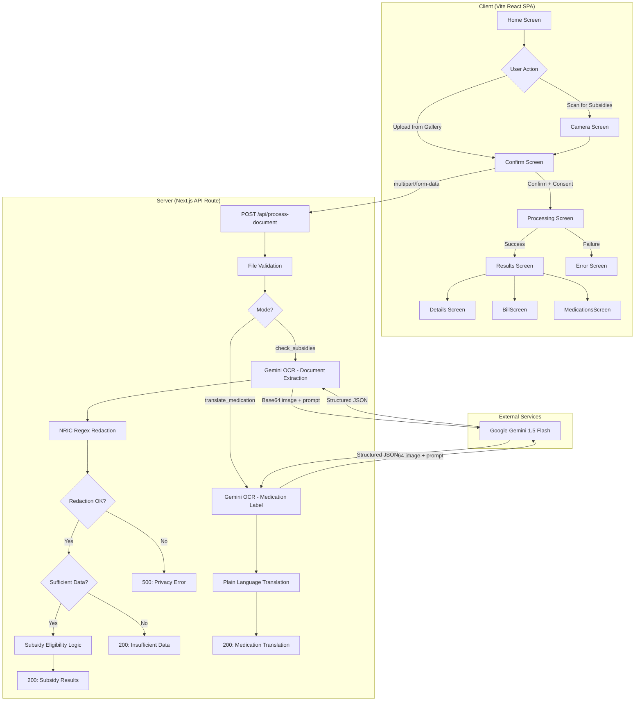
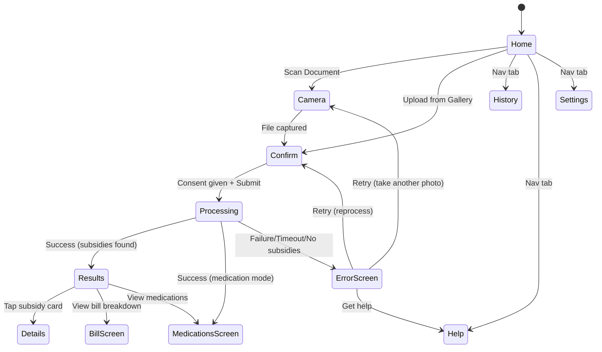
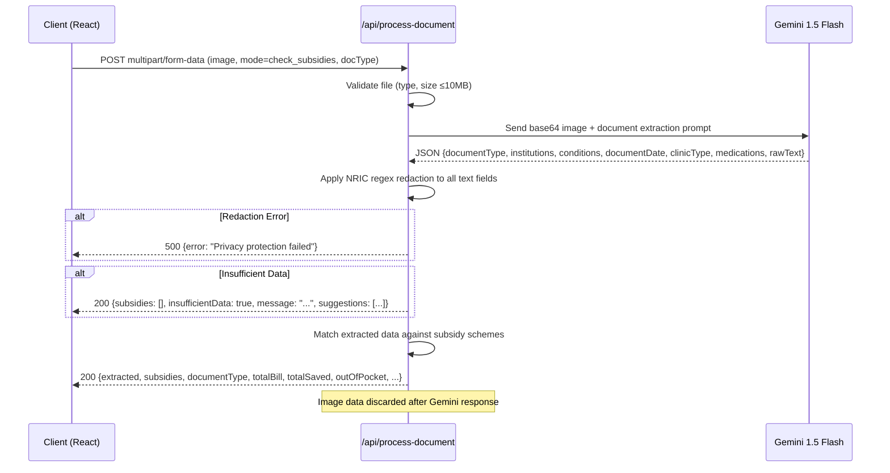
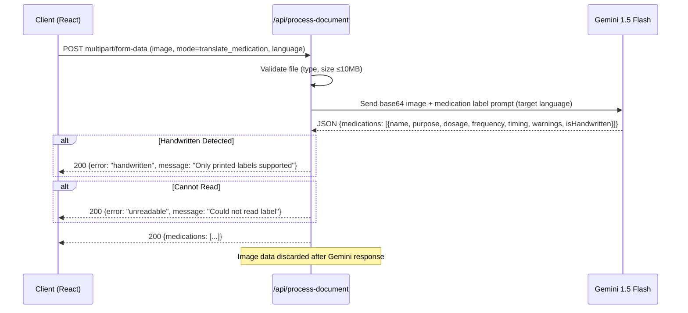

# Design Document: HealthKaki

## Overview

HealthKaki is a privacy-first, accessibility-oriented mobile web app (Vite + React SPA) that helps elderly users in Singapore understand their medical subsidy eligibility and medication instructions. The app has two processing modes:

1. **Subsidy Check Mode**: Scan medical documents (referral letters, diagnosis letters, CDMP letters, prescription letters, follow-up letters, specialist memos) → extract key information → determine subsidy eligibility → present results with TTS.

2. **Medication Translation Mode**: Scan official printed medication labels → extract medication name, purpose, dosage, frequency → translate into simple plain language.

The app uses existing screen components built by the team:
- `Home.tsx` — Landing page with document type guide and CTAs
- `Camera.tsx` — Camera capture / file upload
- `Confirm.tsx` — Document preview, type selection, consent checkboxes
- `Processing.tsx` — Animated progress stages
- `Results.tsx` — Hero cost card + subsidy cards + navigation to details
- `Details.tsx` — Individual subsidy scheme detail view
- `BillScreen.tsx` — Line-by-line bill breakdown
- `MedicationsScreen.tsx` — Medication cards with TTS, timing, expandable details
- `ErrorScreen.tsx` — Error handling with retry (upload, processing, no_subsidies, offline, validation)
- `History.tsx` — Past scan results
- `Help.tsx` — FAQs and contact info
- `Settings.tsx` — Language, TTS speed, accessibility preferences

### Key Design Decisions

| Decision | Rationale |
|----------|-----------|
| Use existing screen components as-is | Friends built polished UI; task is to wire up real API logic behind them |
| Two scan modes selectable from Home | Clear separation; users pick intent (subsidies vs medication) upfront |
| Document type detection via Gemini | Different document types yield different subsidy logic; auto-detection reduces user burden |
| Confirm screen lets user override doc type | Auto-detection may be wrong; user has final say via picker |
| Dual-layer NRIC redaction (Gemini prompt + regex) | LLM redaction is probabilistic; regex is deterministic safety net |
| Fail-closed on redaction errors | Privacy breach > failed request for this demographic |
| Static subsidy scheme data | Read-only reference data; no need for Supabase table; easy to update |
| Insufficient data as first-class flow | Referral letters are sometimes too generic; use ErrorScreen "no_subsidies" type |
| Web Speech API for TTS | Already implemented in `src/lib/tts.ts`; no server costs; supports SG locales |
| Stateless image processing | Images exist only in server memory during API call; discarded after |
| Vite SPA with API route via Next.js | Frontend is Vite React; backend API at `src/app/api/process-document/route.ts` |

## Architecture

### System Architecture Diagram



### Screen Flow



### Request Sequence — Subsidy Check Mode



### Request Sequence — Medication Translation Mode



## Components and Interfaces

### Existing Screens (already built)

The following screens are already implemented and provide the UI layer. The implementation task is to wire them to real API responses instead of `MOCK_RESULT`:

| Screen | File | Current State | Needs |
|--------|------|---------------|-------|
| Home | `src/screens/Home.tsx` | Shows document type guide, CTAs | Add medication scan CTA; update branding to HealthKaki |
| Camera | `src/screens/Camera.tsx` | Captures file, calls `onFileReady` | Works as-is |
| Confirm | `src/screens/Confirm.tsx` | Preview, doc type picker, consent | Works as-is; wire submit to real API |
| Processing | `src/screens/Processing.tsx` | Animated progress stages | Wire to actual API call timing |
| Results | `src/screens/Results.tsx` | Hero card + subsidy cards | Replace `MOCK_RESULT` with real API response |
| Details | `src/screens/Details.tsx` | Subsidy detail view | Wire to real subsidy data |
| BillScreen | `src/screens/BillScreen.tsx` | Line-by-line bill | Wire to real extracted bill lines |
| MedicationsScreen | `src/screens/MedicationsScreen.tsx` | Medication cards + TTS | Wire to real medication data (from OCR or translation) |
| ErrorScreen | `src/screens/ErrorScreen.tsx` | Error types with retry | Works as-is; navigate here on failures |
| History | `src/screens/History.tsx` | Past scans list | Wire to local storage or state |
| Help | `src/screens/Help.tsx` | FAQ + contact | Update content for HealthKaki |
| Settings | `src/screens/Settings.tsx` | Language, TTS, accessibility | Works as-is |

### Existing Utilities (already built)

| Module | File | Purpose |
|--------|------|---------|
| TTS | `src/lib/tts.ts` | Web Speech API wrapper with language support |
| TTSButton | `src/components/TTSButton.tsx` | Reusable TTS trigger button |
| i18n | `src/lib/i18n.tsx` | Language context, translations |
| UI components | `src/components/ui.tsx` | Button, Card, Badge, TopBar, Toggle, Divider |
| Types | `src/lib/types.ts` | Screen, Language, SubsidyCard, Medication, etc. |
| Utils/Mocks | `src/lib/utils.ts` | MOCK_RESULT, MOCK_HISTORY |
| Gemini | `src/lib/gemini.ts` | Gemini API wrapper |
| Supabase | `src/lib/supabase/` | Supabase client (may not be needed for schemes) |

### Server-Side Modules (to implement)

```typescript
// ============================================================
// src/lib/nric-redactor.ts
// ============================================================

interface RedactionResult {
  success: boolean;
  redactedText: string;
  redactionCount: number;
}

/**
 * Redacts all NRIC patterns from text. Fail-closed semantics.
 * Full: [STFG]\d{7}[A-Z], Partial: [STFG]\d{4,6}[A-Z]
 */
export function redactNric(text: string): RedactionResult;
export function redactExtractedData(data: RawExtractedData): RedactedExtractedData;

// ============================================================
// src/lib/ocr-pipeline.ts
// ============================================================

type DocumentType = "referral_letter" | "diagnosis_letter" | "prescription_letter" | "follow_up_letter" | "specialist_memo" | "unknown";

interface RawExtractedData {
  documentType: DocumentType;
  institutions: string[];
  conditions: string[];
  documentDate: string | null;
  clinicType: string | null;
  medications: string[];
  rawText: string;
}

interface RedactedExtractedData extends Omit<RawExtractedData, 'rawText'> {
  rawText: string; // NRICs replaced with [REDACTED]
}

export async function processDocumentForSubsidies(
  fileBuffer: ArrayBuffer,
  mimeType: string,
  docTypeHint?: string
): Promise<{ extracted: RedactedExtractedData }>;

// ============================================================
// src/lib/medication-translator.ts
// ============================================================

interface MedicationTranslation {
  name: string;
  genericName: string;
  purpose: string;        // plain language
  dosage: string;
  frequency: string;
  timing: string;
  specialNotes: string;
  isHandwritten: boolean;
  icon: string;           // emoji for display
  translations: Record<string, { purpose: string; frequency: string; timing: string; specialNotes: string }>;
}

export async function translateMedicationLabel(
  fileBuffer: ArrayBuffer,
  mimeType: string,
  targetLanguage: string
): Promise<{ medications: MedicationTranslation[] }>;

// ============================================================
// src/lib/subsidy-logic.ts
// ============================================================

export interface SubsidyScheme {
  schemeName: string;
  schemeType: string;
  eligibleClinicTypes: string[];
  conditionKeywords: string[];
  coverageDescription: string;
  eligibilityConditions: string;
}

export function lookupSubsidies(extracted: RedactedExtractedData): {
  subsidies: SubsidyCard[];  // matches existing SubsidyCard type from src/lib/types.ts
  insufficientData: boolean;
  message: string | null;
  suggestions: string[];
  totalBill: number;
  totalSaved: number;
  outOfPocket: number;
  finalCost: number;
};

export function hasEnoughDataForSubsidyMatch(data: RedactedExtractedData): boolean;

// ============================================================
// src/lib/subsidy-schemes.ts
// ============================================================

// Static reference data for all Singapore subsidy schemes
export const SUBSIDY_SCHEMES: SubsidyScheme[];
```

### API Route Interface

```typescript
// POST /api/process-document
// Content-Type: multipart/form-data

// Request body:
// - file: File (JPEG, PNG, WebP, HEIC, PDF; max 10MB)
// - mode: "check_subsidies" | "translate_medication"
// - docType?: string (user-selected document type from Confirm screen)
// - language?: string (for medication translation target language)

// === Subsidy Check Response (200): ===
interface SubsidyCheckResponse {
  mode: "check_subsidies";
  extracted: RedactedExtractedData;
  documentType: DocumentType;
  subsidies: SubsidyCard[];     // matches existing type for Results_Screen
  insufficientData: boolean;
  message: string | null;
  suggestions: string[];
  totalBill: number;
  totalSaved: number;
  outOfPocket: number;
  finalCost: number;
  confidence: number;           // 0-100 match confidence
  canUseMediSave: boolean;
  mediSaveBalance: number;
  billLines: BillLine[];        // for BillScreen
  medications: Medication[];    // for MedicationsScreen (if extracted from doc)
}

// === Medication Translation Response (200): ===
interface MedicationTranslationResponse {
  mode: "translate_medication";
  medications: Medication[];    // matches existing Medication type
}

// Error Responses:
// 400: { error: "No file provided" | "Unsupported file type" | "File too large" | "PDF exceeds 5 pages" | "Invalid mode" }
// 500: { error: "Privacy protection failed" | "Document extraction failed" }
// 504: { error: "Processing timed out" }
```

## Data Models

### Subsidy Schemes (Static Configuration)

```typescript
// src/lib/subsidy-schemes.ts
// Uses conditionKeywords for matching against extracted document conditions

export const SUBSIDY_SCHEMES = [
  {
    schemeName: "Pioneer Generation",
    schemeType: "pioneer",
    eligibleClinicTypes: ["public_hospital", "polyclinic", "gp_clinic", "specialist_outpatient"],
    conditionKeywords: [], // age-based, not condition-based
    birthYearMax: 1949,
    coverageDescription: "Additional subsidies on top of existing schemes for Pioneer Generation Singaporeans",
    eligibilityConditions: "Born on or before 31 Dec 1949, became citizen before 1 Jan 1987",
  },
  {
    schemeName: "Merdeka Generation",
    schemeType: "merdeka",
    eligibleClinicTypes: ["public_hospital", "polyclinic", "gp_clinic", "specialist_outpatient"],
    conditionKeywords: [],
    birthYearMin: 1950,
    birthYearMax: 1959,
    coverageDescription: "Additional subsidies for Merdeka Generation Singaporeans",
    eligibilityConditions: "Born between 1 Jan 1950 and 31 Dec 1959, became citizen before 31 Dec 1996",
  },
  {
    schemeName: "CHAS CDMP",
    schemeType: "chas_cdmp",
    eligibleClinicTypes: ["polyclinic", "gp_clinic"],
    conditionKeywords: ["diabetes", "hypertension", "high blood pressure", "lipids", "cholesterol", "stroke", "asthma", "copd", "chronic obstructive", "schizophrenia", "major depression", "bipolar", "dementia", "osteoarthritis", "benign prostatic hyperplasia", "anxiety", "epilepsy", "parkinson", "nephritis", "nephrosis"],
    coverageDescription: "Subsidised outpatient treatment for chronic conditions at CHAS clinics",
    eligibilityConditions: "CHAS card holder diagnosed with eligible chronic condition",
  },
  // ... CHAS Blue, CHAS Orange, CHAS Green, MediSave, MediShield Life, MediFund
];
```

### Existing Type Definitions (from `src/lib/types.ts`)

The app already defines these types that the API response must conform to:
- `Screen` — all screen names for navigation
- `Language` — 'en' | 'zh' | 'ms' | 'ta'
- `SubsidyCard` — scheme display data (id, name, icon, eligible, saves, outOfPocket, benefits, etc.)
- `Medication` — medication display data (id, name, genericName, icon, purpose, dosage, frequency, timing, specialNotes, translations)
- `HistoryItem` — past scan record
- `ErrorType` — 'upload' | 'processing' | 'no_subsidies' | 'offline' | 'validation'

### NRIC Pattern Definitions

```typescript
const FULL_NRIC_PATTERN = /[STFGstfg]\d{7}[A-Za-z]/g;
const PARTIAL_NRIC_PATTERN = /[STFGstfg]\d{4,6}[A-Za-z]/g;
const ALL_NRIC_PATTERN = /[STFGstfg]\d{4,7}[A-Za-z]/g;
```

## Error Handling

### Strategy

| Context | Strategy | ErrorType Used |
|---------|----------|----------------|
| NRIC redaction failure | **Fail-closed** → reject request | "processing" |
| OCR can't read document | **Fail-graceful** → suggest retake | "upload" |
| Document too generic for subsidies | **Fail-informative** → explain + suggest | "no_subsidies" |
| Handwritten medication label | **Fail-graceful** → inform user | "upload" |
| Network failure | **Fail-retry** → retain file | "offline" |
| Timeout (>30s) | **Fail-retry** → auto-retry once | "processing" |
| File validation failure | **Fail-fast** → immediate feedback | "validation" |
| TTS unavailable | **Fail-silent** → hide button | (no error screen) |

The existing `ErrorScreen` component already handles all these error types with appropriate messaging, icons, and retry navigation. No new error UI is needed.

### Insufficient Data Flow

When a referral letter is too generic (no specific condition, no clinic type mentioned):

```
Extracted: { documentType: "referral_letter", conditions: [], clinicType: null, institutions: ["SGH"] }
→ hasEnoughDataForSubsidyMatch() returns false
→ API returns: { insufficientData: true, message: "...", suggestions: ["Try scanning your diagnosis letter", "Ask your GP for a referral with specific condition"] }
→ Client navigates to ErrorScreen with errorType "no_subsidies"
```

## Testing Strategy

### Unit Tests

| Module | Test Focus |
|--------|------------|
| `nric-redactor.ts` | Pattern matching, partial NRICs, fail-closed on errors |
| `file-validator.ts` | MIME types, size limits, PDF pages |
| `ocr-pipeline.ts` | Gemini response parsing, empty extraction detection |
| `subsidy-logic.ts` | Scheme matching per document type, insufficient data |
| `medication-translator.ts` | Printed vs handwritten, plain language output |
| `subsidy-schemes.ts` | Data completeness, keyword coverage |

### Integration Tests

- Full API route: valid image → extraction → redaction → subsidy → response shape matches existing types
- Medication mode: label image → translation → response matches Medication type
- Error paths: invalid file, privacy failure, timeout
